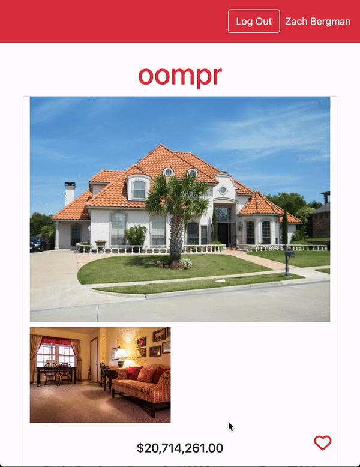

# Oompr Frontend

**Oompr** is a web application that provides a platform for users to browse luxury high-priced real estate based on their selected location. The frontend of Oompr is designed to be minimalist, modern, and user-friendly, offering seamless access to property details and user functionalities like saving favorite properties. A standout feature of Oompr is the **Reality Check**, which allows users to enter their monthly income and view property listings they can realistically afford, providing unique insights into the local real estate market.

**[View the Live Application](https://pacific-dusk-48184-9d5b91032508.herokuapp.com/)**

## Table of Contents

- [Features](#features)
- [Installation](#installation)
- [Usage](#usage)
- [Configuration](#configuration)
- [API Integration](#api-integration)
- [Testing](#testing)
- [Contributors](#contributors)

## Description

The Oompr Frontend is built with a focus on delivering a smooth user experience, allowing users to explore expensive, out-of-reach homes as a pastime. Users can search for properties using a city or geolocation, view detailed property information, and save their favorite listings. The **Reality Check** feature further enhances the user experience by offering a comparative analysis of high-end properties against homes that fit within the user's budget, helping users understand the real estate market relative to their financial situation.

This project is part of a full-stack application, with the backend handling data management and API interactions. The frontend communicates with the backend API to fetch and display data: https://github.com/jdmchugh111/oompr_backend

## Features

- **Search by Location:** Users can search for properties by entering a city or using geolocation services.
- **Property Listings:** View a list of properties with brief details.
    
- **Detailed Property View:** Access comprehensive information about each property, including images, descriptions, and pricing.
- **Favorites:** Logged-in users can save properties to their favorites for easy access.
  
- **Reality Check:** A unique feature that allows users to input their monthly income to receive a set of property listings they can potentially afford.
  
  
- **OAuth Integration:** Users can create accounts and log in using OAuth, providing a seamless and secure authentication process.
   
- **Responsive Design:** The application is mobile-first, ensuring usability across devices.

## Installation

To set up the Oompr Frontend locally, follow these steps:

1. **Clone the repository:**

   ```bash
   git clone https://github.com/jdmchugh111/oompr_frontend.git
   cd oompr_frontend
   ```

2. **Install dependencies:**

   Ensure you have [Ruby](https://www.ruby-lang.org/) and [Bundler](https://bundler.io/) installed. Then run:

   ```bash
   bundle install
   ```

3. **Database Setup:**

   Set up your database by running the following commands:

   ```bash
   rails db:create
   rails db:migrate
   rails db:seed
   ```

4. **Environment Setup:**

   Create a `.env` file in the root directory and add your environment variables, such as the API URL and OAuth credentials:

   ```env
   API_URL=https://whispering-cliffs-26803-3cc31fb2a950.herokuapp.com/api/v1/)
   GOOGLE_CLIENT_ID=your_google_client_id
   GOOGLE_CLIENT_SECRET=your_google_client_secret
   ```

5. **Run the application:**

   Start the Rails server:

   ```bash
   rails server
   ```

   The application will be accessible at `http://localhost:5000`.

## Usage

After starting the server, you can navigate through the application using the following steps:

- **Search for Properties:** Use the search bar on the home screen to enter a city or enable geolocation.
- **View Property Details:** Click on any property listing to see more detailed information.
- **Manage Favorites:** Sign in to save properties to your favorites list and view them later.
- **Reality Check Feature:** Enter your monthly income to activate the "Reality Check" feature, which will provide a new set of property listings that align with your budget. This feature helps users understand what they can realistically afford in the real estate market.
- **OAuth Authentication:** Use Google OAuth to create an account or log in. This feature simplifies the authentication process, enhancing security and user experience.

## Configuration

- **API Integration:** The frontend interacts with the backend API to retrieve property data. Ensure that the `API_URL` is set to the correct API endpoint in your environment variables.
- **Geolocation Services:** Ensure that geolocation permissions are enabled in your browser for location-based searches.
- **OAuth Setup:** Ensure your OAuth credentials are properly configured in the environment variables for successful authentication.

## API Integration

The Oompr Frontend communicates with the backend through RESTful API endpoints. Here are the primary endpoints used:

- **GET /properties:** Fetches a list of properties based on search criteria.
- **GET /properties/:id:** Retrieves detailed information for a specific property.
- **POST /favorites:** Saves a property to the user's favorites list.
- **GET /favorites:** Retrieves the user's list of favorite properties.
- **POST /reality_check:** Provides property listings based on the user’s monthly income for the "Reality Check" feature.
- **OAuth Endpoints:** Handles user authentication and authorization via Google OAuth.

## Testing

Testing ensures the reliability and functionality of the application. Here's how to run tests:

- **Run Tests:**

  ```bash
  rails test
  ```

- **Testing Frameworks:** The project utilizes [RSpec](https://rspec.info/) and [Capybara](https://teamcapybara.github.io/capybara/) for unit and integration tests.

## Contributors

- Rodrigo Chaves - [Github](https://github.com/RodrigoACG) - [LinkedIn](https://www.linkedin.com/in/rodrigo-chavez1/)
- James McHugh - [Github](https://github.com/jdmchugh111) - [LinkedIn](https://www.linkedin.com/in/jdmchugh111/)
- Zach Bergman - [Github](https://github.com/zach-bergman) - [LinkedIn](https://www.linkedin.com/in/zacherybergman/)
